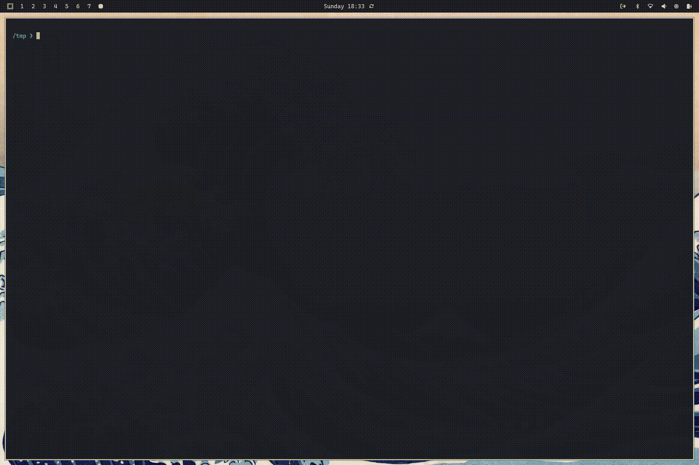

# Trafic Fines package

Tarea del **Máster Big Data, & Data Engineering 2025-2026**, crear el paquete `traficFines` con dos submódulos `cache` y `madridFines` crear un paquete instalable y conseguir una cobertura del **100%** en los tests.

## Análisis previo

El paquete `traficFines` a través de la clase `MadridFines` tiene como objetivo automatiza el ciclo de análisis de multas del Ayuntamiento de Madrid accesibles desde la web: https://datos.madrid.es/dataset/210104-0-multas-circulacion-detalle.

Se realiza un análisis exploratorio previo de los datos con el objetivo de familizarnos con el datos que vamos a tratar. [Ver notebook](./notebooks/analisis_exploratorio.ipynb).

## Consideraciones

- Se usa [uv](https://docs.astral.sh/uv/) como gestor de paquetes.
- Uso de los apuntes de clase y las recomendaciones de [packaging de python](https://packaging.python.org/en/latest/tutorials/packaging-projects/) y [setuptools](https://setuptools.pypa.io/en/latest/userguide/datafiles.html#include-package-data) para el empaquetado.
- Se sigue la estructura recomendada guía de packaging de python:
  ```bash
  packaging_tutorial/
  └── src/
      └── example_package_YOUR_USERNAME_HERE/
          ├── __init__.py
          └── example.py
  ```
- Configuración de settings en vscode:
  * https://github.com/ArjanCodes/examples/blob/main/2024/vscode_python/.vscode/settings.json
  * https://github.com/CoreyMSchafer/dotfiles/blob/master/settings/VSCode-Settings.json


## Intrucciones de uso

Existe una guía con las intrucciones de uso del módulo `traficFines` en [ejemplo_uso.ipynb](./notebooks/ejemplos_uso.ipynb).




## Tests

- En el directorio `tests/test_files` se incluyen los ficheros de datos para simular las respuestas a las peticiones web al portal de datos del ayuntamiento de Madrid.
  * `metadata.rdf` es un fichero reducido del fichero original de metadata.
  * `metadata_fake.rdf` contiene un registro del `xml` mal construido para poder testear el parser `parse_multas_madrid_rdf` en este caso.
  * Los ficheros de multas `multas_month_2024.csv` son una versión reducida de los ficheros originales que se construyen con los primero 5000 registros (`head -n 5000`) de estos.
- `pytest`:
  * Archivos temporales en [pytest](https://docs.pytest.org/en/stable/how-to/tmp_path.html).
  * Para mockear las peticiones web se usa la librería [responses](https://pypi.org/project/responses/).ç
  * Para modificar atributos y variables de entorno se usa [monkeypatch](https://docs.pytest.org/en/stable/reference/reference.html#pytest.monkeypatch.monkeypatch).
- Se incluye un flujo de **github actions** [./.github/workflows/test.yml](./.github/workflows/test.yml) para que se ejecuten los test en cada `push` o `pull requests` al repositorio.


---
[@title]: #
[Source - https://stackoverflow.com/a/35760941]: #
[Posted by Harmon, modified by community. See post 'Timeline' for change history]: #
[Retrieved 2026-02-26, License - CC BY-SA 4.0]: #

<footer style="width:100%; display:flex; justify-content:center; margin:3rem 0;">
    <p align="center">
      <a href="https://alejandrodecora.es/til" style="width:100%; display:flex; justify-content:center; text-decoration: none;">
          Hecho con 💜 por
          <!-- prettier-ignore -->
          <svg viewBox="0 0 600 530" version="1.1" xmlns="http://www.w3.org/2000/svg" style="position: relative; top: 4px; height: 1.25em;">
          <path
            d="m135.72 44.03c66.496 49.921 138.02 151.14 164.28 205.46 26.262-54.316 97.782-155.54 164.28-205.46 47.98-36.021 125.72-63.892 125.72 24.795 0 17.712-10.155 148.79-16.111 170.07-20.703 73.984-96.144 92.854-163.25 81.433 117.3 19.964 147.14 86.092 82.697 152.22-122.39 125.59-175.91-31.511-189.63-71.766-2.514-7.3797-3.6904-10.832-3.7077-7.8964-0.0174-2.9357-1.1937 0.51669-3.7077 7.8964-13.714 40.255-67.233 197.36-189.63 71.766-64.444-66.128-34.605-132.26 82.697-152.22-67.108 11.421-142.55-7.4491-163.25-81.433-5.9562-21.282-16.111-152.36-16.111-170.07 0-88.687 77.742-60.816 125.72-24.795z"
            fill="#1185fe" />
          </svg>
          <code>@vichelocrego</code>
      </a>
    </p>
</footer>